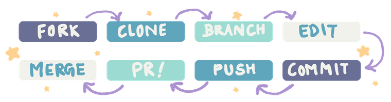

Hey! You!

First time round these corners? Well don't worry, I gotchu 💅🏻

# Probably Your First Contribution

Welcome to your first GitHub contribution!

Our goal today: To give you hands-on experience with the basic workflow used in collaborative software projects.

You will make a teeny tiny change to this repository, create a Pull Request, and get your contribution merged!

\**add some inspiring quote about how even small actions leave a huge impact*\*

## What you will learn
- [ ] Fork a GitHub repository
- [ ] Clone a repository
- [ ] Create and switch branches
- [ ] Make changes and commits
- [ ] Push changes to GitHub
- [ ] Create a Pull Request
- [ ] Review Pull Requests
- [ ] Resolve merge conflicts
- [ ] Understand the basic Git collaboration workflow

## Your task
Add exactly one sentence you like to contributors.md.

Remember:
- Modify `contributors.md` only.
- Do not delete or modify existing contributions.
- Do not add personal information.
- Create a Pull Request for your contribution.

## Workflow

Always learn by doing!